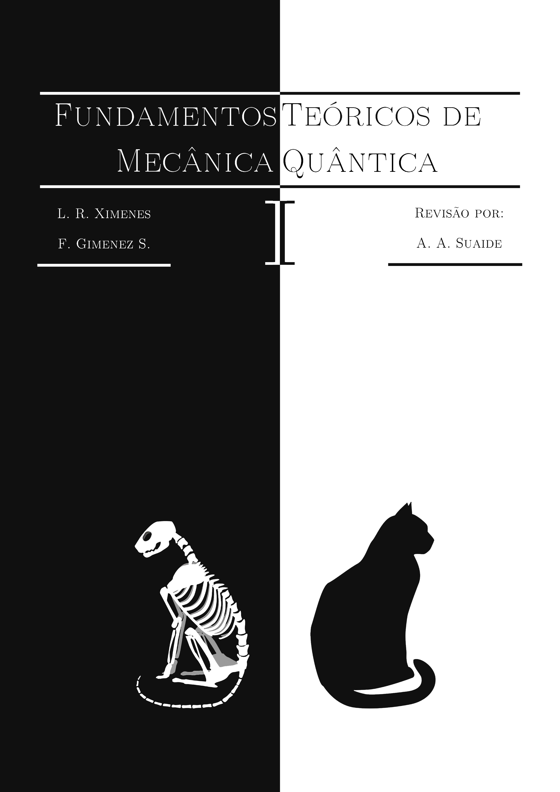

# Home

Welcome to my personal website! Here you will find a collection of information and documents related to my studies and career in physics, starting from my early days as an undergraduate student at. Additionally, you will find links to  interesting websites I recommend and pages of researchers I admire.

## All of my files

  
  <figcaption style="display: block">A Soft Template
     <small><a href="https://jimeens.github.io/projects/latex/">LaTeX Template</a></small>
  </figcaption>

  
  <figcaption style="display: block">Quantum Mechanics I
     <small><a href="https://jimeens.github.io/projects/notes/">Lecture notes</a></small>
  </figcaption>

  
  <figcaption style="display: block">Quantum Mechanics II
     <small><a href="https://jimeens.github.io/projects/notes/">Lecture notes</a></small>
  </figcaption>

  
  <figcaption style="display: block">Homework I
     <small><a href="https://jimeens.github.io/projects/notes/">My Solutions</a></small>
  </figcaption>

 

<!-- Line break -->

  
  <figcaption style="display: block">Homework II
     <small><a href="https://jimeens.github.io/projects/notes/">My Solutions</a></small>
  </figcaption>

  
  <figcaption style="display: block">Study Guide I
     <small><a href="https://jimeens.github.io/projects/notes/">My Solutions</a></small>
  </figcaption>

 

<!-- Line break -->

  
  <figcaption style="display: block">Study Guide II
     <small><a href="https://jimeens.github.io/projects/notes/">My Solutions</a></small>
  </figcaption>

 
